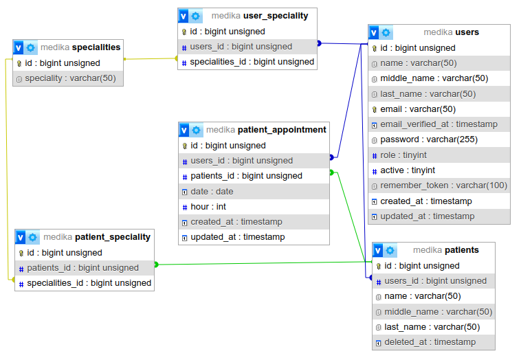

## Tec-Medika

### Tecnologías usadas
* Laravel 10 - Framework
* Livewire 3 - Backend
* Bootstrap 5 - Frontend
* MySQL 8 - Persistencia
* jsPDF 2 - Generador PDF

### Instalación

1. Clonar repositorio
```bash
git clone https://github.com/tr3nt/tec-medika.git
```
2. Ejecutar composer
```bash
composer install
```
3. Copiar del archivo **.env.example** a **.env**
```bash
cp .env.example .env
```
4. Modificar el archivo **.env** con los datos de MySQL
```
DB_DATABASE=medika
DB_USERNAME=root
DB_PASSWORD=secret
```
5. Correr migraciones, seeders y permisos
```bash
php artisan migrate
```
```bash
php artisan db:seed
```
```bash
php artisan key:generate
```
6. Ejecutar Node
```bash
npm install
```
```bash
npm run build
```
7. Usuarios | Contrseñas de pruebas
- admin: admin@gmail.com | 12345678
- medico: user1@gmail.com | 12345678
- medico: user2@gmail.com | 12345678
- medico: user3@gmail.com | 12345678

### Diseño base de datos


### Creado para Tecnolika por
#### Esaim Najera Mondragon